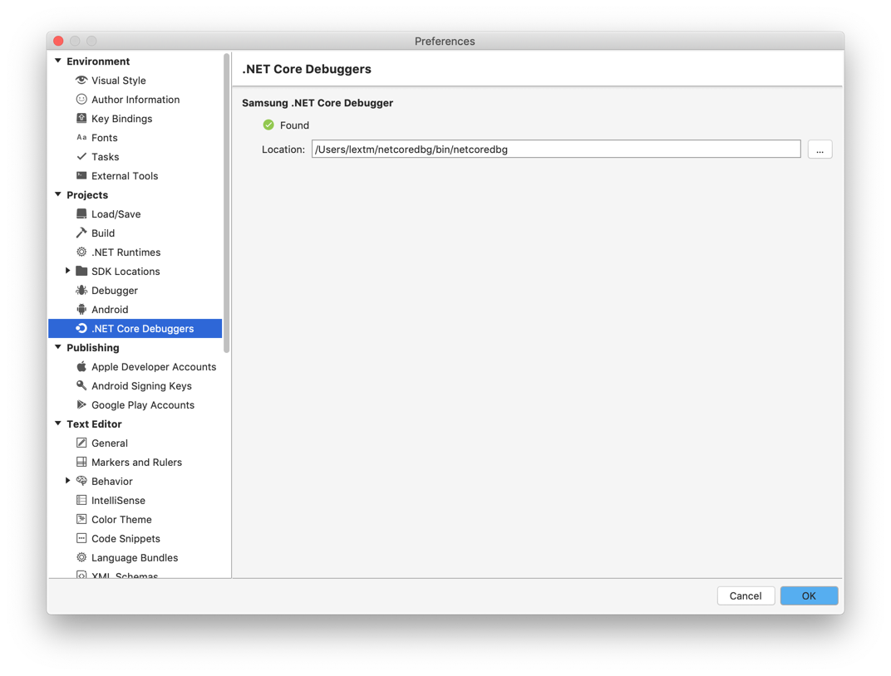

Samsung .NET Core Debugger Extension for MonoDevelop
====================================================
MonoDevelop does not have built-in .NET Core debugging support, due to the
fact that Microsoft does not license its own .NET Core debugger (vsdbg) to
anything other than Visual Studio/Visual Studio Code.

This extension uses the open source .NET Core debugger provided by Samsung to
fill the gaps.

The code is released under MIT/X11 license.

Copyright (C) 2019 LeXtudio Inc. (http://www.lextudio.com)

**Please use with caution and report issues here.**

Installation
------------
1. Download the .mpack files from https://github.com/lextudio/monodevelop.netcoredbg/releases/tag/v1.0, and install in MonoDevelop 7/8. (No plan to support older releases).
1. Clone netcoredbg source code from my personal fork, https://github.com/lextm/netcoredbg/tree/test and compile from "test" branch so that all patches are included. (Note that you have to use my fork right now, while Samsung is fixing their debugger.)
1. Copy the compiled files from `bin` folder to your user folder `~/netcoredbg/bin`. Run `~/netcoredbg/bin/netcoredbg --help` to confirm everything works. (Note that on Windows you should copy to My Documents).

Then you should be able to debug .NET Core projects in MonoDevelop.

Note that you can also use Preferences to select Samsung .NET Core debugger location,

Known Issues
------------
* Some breakpoints might not break.
